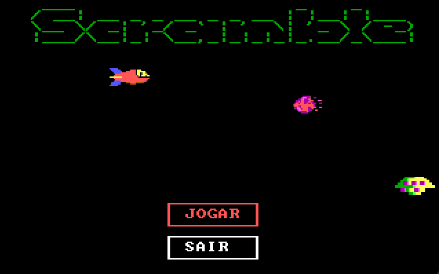
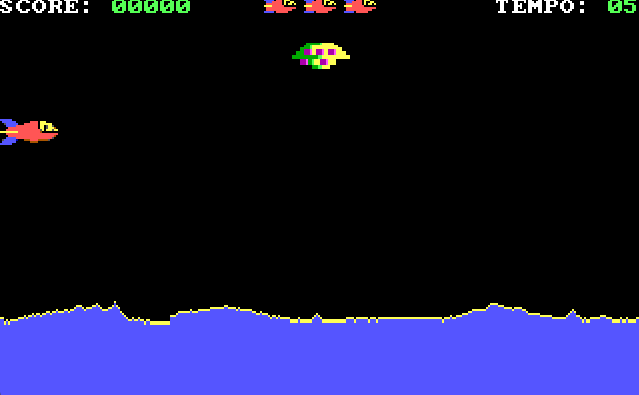

> Trabalho acadêmico, com foco em compreensão prática de arquitetura de computadores e programação em baixo nível utilizando Assembly 8086.

# 🚀 Projeto Assembly: Jogo Scramble (1981)

TDE-B da matéria de Arquitetura de Computadores - 2025/04
Desenvolvido por **Henrique Britz Hahn** & **João Paulo Escobar Martins**.
Projeto desenvolvido em **Assembly 8086** que implementa um jogo com interface gráfica em modo VGA (13h), incluindo menu interativo, animações, sprites e controle de estado do jogo.

Onde instalar o TASM: [Gui Turbo Assembler](https://sourceforge.net/projects/guitasm8086/)


---


## 🎬 Referência

Vídeo do jogo original:  
https://www.youtube.com/watch?v=3Vc-RIkpk40

## 🖼️ Demonstração

### Tela inicial


### Fase 1


## 📌 Sobre o projeto

Este projeto explora programação de baixo nível com acesso direto ao hardware, utilizando interrupções da BIOS e manipulação manual de memória de vídeo.

O jogo conta com:

- Menu interativo com navegação por teclado
- Animações em tempo real (nave, meteoro, alien)
- Sistema de vidas
- Tela de Game Over e Vitória
- Geração de números pseudoaleatórios
- Renderização manual de sprites

## 🔍 Destaques técnicos

- Implementação de renderização gráfica direta em memória (framebuffer)
- Uso de interrupções da BIOS para entrada e saída
- Estruturação manual de estados de jogo sem abstrações de alto nível
- Simulação de animação em ambiente sem suporte nativo

## 🧠 Conceitos aplicados

- Programação em modo real (16 bits)
- Manipulação de registradores do 8086 (AX, BX, CX, DX, SI, DI)
- Segmentação de memória (CS, DS, ES, SS)
- Manipulação direta de memória de vídeo (`0xA000`)
- Interrupções da BIOS (`int 10h`, `int 16h`, `int 15h`)
- Renderização de gráficos em baixo nível
- Gerenciamento de estado do jogo (vidas, fases, pontuação)
- Algoritmos pseudoaleatórios

## ⚙️ Tecnologias

- Assembly 8086 (16 bits)
- Turbo Assembler (TASM)
- Turbo Linker (TLINK)
- Modo gráfico VGA 13h (320x200, 256 cores)
- DOSBox / GUI Turbo Assembler

## 📂 Estrutura do projeto

```bash
.
├── tde.asm           # Código principal do jogo
├── requisitos.md     # Descrição dos requisitos
├── descricao.pdf     # Documentação do projeto
└── README.md
```
## ▶️ Como executar

### 🔧 Pré-requisitos

- DOSBox ou GUI Turbo Assembler
- Turbo Assembler (TASM)
- Turbo Linker (TLINK)

---

### 💡 Usando GUI Turbo Assembler

1. Abrir o arquivo `tde.asm`  
2. Compilar (Build)  
3. Executar (Run)  

---

### 🛠️ Compilação via terminal (TASM)

```bash
tasm tde.asm
tlink tde.obj
tde.exe
```

